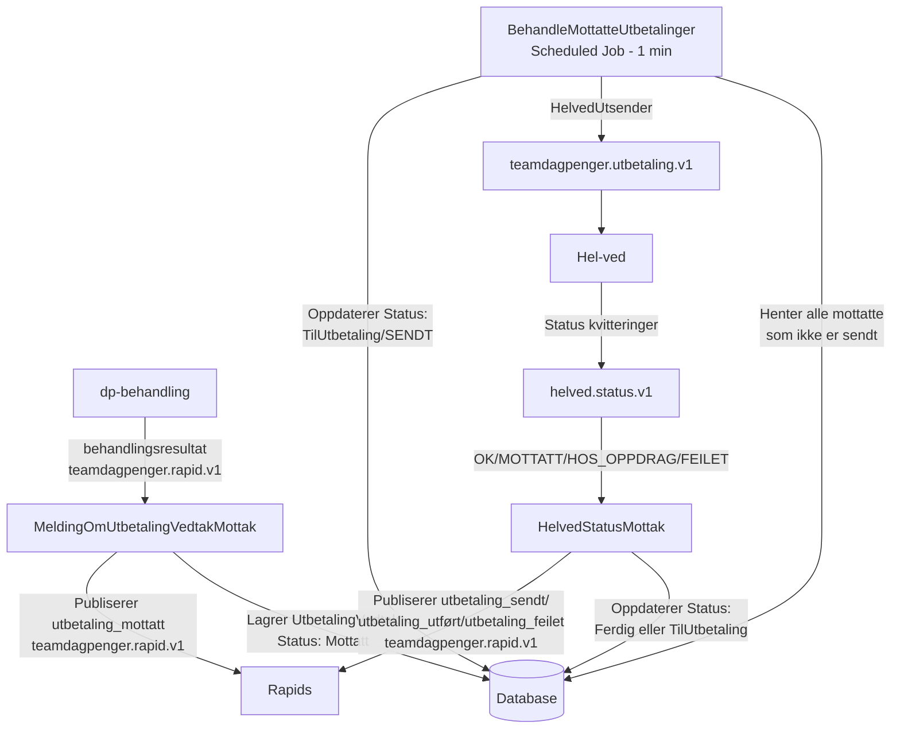

# dp-mellom-barken-og-veden


## Ansvarsområder

- Reagere på behandlingsresultat hendelser med utbetalinger fra [dp-behandling](https://github.com/navikt/dp-behandling) 
- Sørge for å effekturere utbetalinger til Hel-ved (https://helved-docs.ansatt.dev.nav.no) 
- Lytter på status på utbetalinger og oppdaterer behandling med resultat

### Flyttdiagram




## Utvikling

### Komme i gang

Gradle brukes som byggverktøy og er bundlet inn.

```
./gradlew build
```

# Henvendelser

Spørsmål knyttet til koden eller prosjektet kan rettes mot:

* Eller en annen måte for omverden å kontakte teamet på

## For NAV-ansatte

Interne henvendelser kan sendes via Slack i kanalen #dagpenger-dev.
